<div align="center">



# 🐙 KRAKENVIM

[](https://neovim.io)
[](https://www.lua.org)
[](https://github.com/folke/lazy.nvim)
[](LICENSE)

**A modern, modular Neovim config**

[Features](#-features) • [Installation](#-installation) • [Keybindings](#-keybindings) • [Plugins](#-plugin-reference)

</div>

---

## 📑 Table of Contents

- [About](#-about)
- [Features](#-features)
- [Screenshots](#-screenshots)
- [Requirements](#-requirements)
- [Installation](#-installation)
  - [Linux](#-linux)
  - [Windows](#-windows)
  - [macOS](#-macos)
- [Post-Installation Setup](#-post-installation-setup)
- [Language Support](#-language-support)
  - [Python](#python)
  - [JavaScript/TypeScript](#javascripttypescript)
  - [Java](#java)
  - [Rust](#rust)
  - [Go](#go)
  - [C/C++](#cc)
  - [Lua](#lua)
  - [Web Development](#web-development)
- [Plugin Reference](#-plugin-reference)
- [Keybindings](#-keybindings)
- [Themes](#-themes)
- [Customization](#-customization)
- [Troubleshooting](#-troubleshooting)
- [Contributing](#-contributing)
- [License](#-license)

---

## 🐙 About

**KrakenVim** is a from-scratch Neovim configuration that combines modern plugin architecture with familiar keybindings. Built with [lazy.nvim](https://github.com/folke/lazy.nvim) for lightning-fast startup times and modular plugin management.

### Philosophy

- **Clean Foundation**: Built from the ground up, no bloat
- **Muscle Memory**: Preserves AstroNvim-style keybindings for seamless transition
- **Modular Design**: Organized plugin structure for easy customization
- **Language-First**: Complete LSP, DAP, and tooling for 15+ languages
- **Performance**: Aggressive lazy loading with sub-100ms startup
- **Beautiful**: 15 carefully selected themes with persistent picker

---

## ✨ Features

- ⚡ **Blazing Fast**: Aggressive lazy loading with header caching and sub-100ms startup
- 🎨 **15 Beautiful Themes**: Persistent colorscheme picker with live preview
- 🔍 **Powerful Fuzzy Finding**: Telescope with fzf-native for instant file/text search
- 💡 **Full LSP Support**: 15+ languages with auto-completion, diagnostics, and formatting
- 🐛 **Complete Debugging**: DAP configurations for Python, JS/TS, Java, Go, Rust, C/C++
- 🌳 **Treesitter 1.0**: Next-gen syntax highlighting and code understanding
- 🤖 **AI-Powered Completion**: GitHub Copilot integration with nvim-cmp
- 🔧 **Auto-Formatting**: conform.nvim with 20+ formatters
- 🔎 **Linting**: nvim-lint for real-time code quality checks
- 🌊 **Smooth Animations**: Neoscroll for buttery scrolling
- 📊 **Beautiful UI**: Custom statusline, bufferline, dashboard, and notifications
- 🎨 **Custom Header System**: Cached ASCII art headers with instant loading and persistent state
- 🎮 **Discord Presence**: Show your coding activity
- ⏱️ **Pomodoro Timer**: Built-in productivity timer
- 📝 **Note Taking**: Obsidian.nvim integration
- 🎯 **Typing Practice**: Built-in typing tutor
- 🚀 **Git Integration**: Lazygit, gitsigns, and diffview
- 📦 **Package Manager**: Mason for automatic LSP/DAP/formatter installation
- 🔄 **Session Management**: Persistent theme selection across sessions
- 🎪 **Markdown Preview**: Live preview and beautiful rendering
- 🏗️ **Build Integration**: Compiler.nvim + overseer for project builds

---

## 📸 Screenshots

### Dashboard


_Alpha dashboard with cycling ASCII art headers and quick actions_

**Features:**

- **11 Built-in Headers**: Anime artwork (8), logos (2), minimal designs (1)
- **Header Cycling**: Navigate through headers with keybindings or dashboard button
- **Persistent State**: Remembers your last selected header across sessions
- **Custom Headers**: Convert your own images to ASCII art with included script

### Code Editing


_LSP in action with inlay hints, auto-completion, and diagnostics_

### Debugging


_DAP UI showing Python debugging with breakpoints and variable inspection_

### Theme Picker


_Telescope colorscheme picker with live preview and persistent selection_

### File Explorer


_Neo-tree file explorer with Git integration and file icons_

---

## 📦 Requirements

### Core Requirements

| Requirement   | Minimum Version | Purpose                                       |
| ------------- | --------------- | --------------------------------------------- |
| **Neovim**    | 0.10.0          | Core editor with modern Lua API               |
| **Git**       | 2.19.0          | Plugin management and version control         |
| **Node.js**   | 16.x            | LSP servers and tooling                       |
| **npm/yarn**  | Latest          | Package management                            |
| **Nerd Font** | Any             | Icons and glyphs (recommended: JetBrainsMono) |

### Recommended Tools

```bash
# Better search/find
ripgrep      # Fast grep alternative (required for Telescope live_grep)
fd           # Fast find alternative (better file finding)

# Git tools
lazygit      # Terminal UI for Git (required for <leader>gg)

# File manager
yazi         # Modern terminal file manager (required for <leader>-)

# Build tools
make         # Required for telescope-fzf-native compilation
gcc/clang    # C compiler for native extensions
```

### Language-Specific Dependencies

#### Python

- Python 3.8+
- pip (package manager)

#### JavaScript/TypeScript

- Node.js 16+
- npm or yarn

#### Java

- JDK 17+ (multiple versions supported via SDKMAN/asdf)
- Maven or Gradle (auto-detected)

#### Rust

- Rust 1.70+ (via rustup)
- cargo (included with Rust)

#### Go

- Go 1.20+

#### C/C++

- GCC 11+ or Clang 14+
- CMake (for project builds)

#### Web Development

- Node.js (for live-server)
- Browser for preview

---

## 🚀 Installation

### 🐧 Linux

#### Backup Existing Configuration

```bash
# Backup your current Neovim config
mv ~/.config/nvim ~/.config/nvim.backup
mv ~/.local/share/nvim ~/.local/share/nvim.backup
mv ~/.local/state/nvim ~/.local/state/nvim.backup
mv ~/.cache/nvim ~/.cache/nvim.backup
```

#### Clone KrakenVim

```bash
git clone https://github.com/lxrdxe7o/KrakenVim.git ~/.config/nvim
```

#### Install Dependencies

**Arch Linux:**

```bash
sudo pacman -S neovim git nodejs npm ripgrep fd lazygit make gcc
```

**Ubuntu/Debian:**

```bash
sudo apt update
sudo apt install neovim git nodejs npm ripgrep fd-find make gcc
```

**Fedora:**

```bash
sudo dnf install neovim git nodejs npm ripgrep fd-find lazygit make gcc
```

#### Install a Nerd Font

```bash
# Download JetBrainsMono Nerd Font
mkdir -p ~/.local/share/fonts
cd ~/.local/share/fonts
curl -fLo "JetBrainsMono Nerd Font.ttf" \
  https://github.com/ryanoasis/nerd-fonts/releases/latest/download/JetBrainsMono.zip
unzip JetBrainsMono.zip
fc-cache -fv

# Set in your terminal emulator settings
```

#### Launch Neovim

```bash
nvim
```

Lazy.nvim will automatically install all plugins on first launch. This may take 2-3 minutes.

---

### 🪟 Windows

#### Backup Existing Configuration

```powershell
# PowerShell
Move-Item -Path "$env:LOCALAPPDATA\nvim" -Destination "$env:LOCALAPPDATA\nvim.backup"
Move-Item -Path "$env:LOCALAPPDATA\nvim-data" -Destination "$env:LOCALAPPDATA\nvim-data.backup"
```

#### Clone KrakenVim

```powershell
git clone https://github.com/lxrdxe7o/KrakenVim.git "$env:LOCALAPPDATA\nvim"
```

#### Install Dependencies

**Using Scoop:**

```powershell
scoop install neovim git nodejs ripgrep fd lazygit make gcc
```

**Using Chocolatey:**

```powershell
choco install neovim git nodejs ripgrep fd lazygit make mingw
```

#### Install a Nerd Font

1. Download [JetBrainsMono Nerd Font](https://github.com/ryanoasis/nerd-fonts/releases/latest)
2. Extract and install the `.ttf` files
3. Set font in Windows Terminal or your terminal emulator

#### Launch Neovim

```powershell
nvim
```

---

### 🍎 macOS

#### Backup Existing Configuration

```bash
mv ~/.config/nvim ~/.config/nvim.backup
mv ~/.local/share/nvim ~/.local/share/nvim.backup
mv ~/.local/state/nvim ~/.local/state/nvim.backup
mv ~/.cache/nvim ~/.cache/nvim.backup
```

#### Clone KrakenVim

```bash
git clone https://github.com/lxrdxe7o/KrakenVim.git ~/.config/nvim
```

#### Install Dependencies

```bash
# Install Homebrew if not already installed
/bin/bash -c "$(curl -fsSL https://raw.githubusercontent.com/Homebrew/install/HEAD/install.sh)"

# Install dependencies
brew install neovim git node ripgrep fd lazygit
```

#### Install a Nerd Font

```bash
brew tap homebrew/cask-fonts
brew install font-jetbrains-mono-nerd-font
```

Set the font in your terminal emulator (iTerm2, Alacritty, etc.)

#### Launch Neovim

```bash
nvim
```

---

## ⚙️ Post-Installation Setup

### First Launch

On first launch, KrakenVim will:

1. **Bootstrap lazy.nvim** - Plugin manager auto-installs
2. **Install all plugins** - 60+ plugins downloaded and configured
3. **Display Alpha dashboard** - Custom Kraken ASCII art

Wait for all plugins to install (check bottom-right notifications).

### Install LSP Servers

KrakenVim uses Mason for automatic tool installation:

```vim
:Mason
```

The following will auto-install based on your language files:

**Auto-Installed LSP Servers:**

- `lua_ls` - Lua
- `ts_ls` - TypeScript/JavaScript
- `pyright` - Python
- `gopls` - Go
- `rust_analyzer` - Rust (via rustaceanvim)
- `clangd` - C/C++
- `jdtls` - Java
- `html`, `cssls`, `tailwindcss` - Web
- `jsonls`, `yamlls`, `taplo` - Data formats
- `bashls` - Shell scripts

**Auto-Installed Formatters:**

- `stylua` - Lua
- `prettier` - JS/TS/HTML/CSS/JSON/Markdown
- `black`, `isort` - Python
- `gofumpt`, `goimports` - Go
- `rustfmt` - Rust
- `clang-format` - C/C++
- `google-java-format` - Java

**Auto-Installed Linters:**

- `eslint_d` - JavaScript/TypeScript
- `ruff` - Python
- `golangcilint` - Go
- `shellcheck` - Shell scripts

**Auto-Installed Debug Adapters:**

- `debugpy` - Python
- `js-debug-adapter` - JavaScript/TypeScript
- `delve` - Go
- `codelldb` - C/C++/Rust
- `java-debug-adapter` - Java

### Verify Installation

Check LSP status:

```vim
:LspInfo
:Mason
:checkhealth
```

---

## 🌐 Language Support

### Python

#### Setup

1. **Install Python 3.8+**

   ```bash
   # Linux
   sudo apt install python3 python3-pip python3-venv

   # macOS
   brew install python@3.11

   # Windows
   # Download from python.org
   ```

2. **LSP, Formatter, Linter Auto-Install**

   - Open any `.py` file
   - Mason auto-installs: `pyright`, `debugpy`, `black`, `isort`, `ruff`

3. **Virtual Environment Support**
   - Automatically detects `venv`, `virtualenv`, `conda`
   - Debugging configurations use active environment

#### Features

- **LSP**: Auto-completion, go-to-definition, hover docs, refactoring
- **Formatting**: Black (line length 88) + isort (import sorting)
- **Linting**: Ruff (fast Python linter)
- **Debugging**:
  - Launch current file
  - Launch with arguments
  - Django development server
  - Flask application
  - Attach to running process
- **Type Checking**: Pyright with basic mode

#### Django/Flask

Pre-configured debug profiles:

**Django:**

```vim
:DapContinue
" Select 'Launch Django'
" Starts manage.py runserver --noreload
```

**Flask:**

```vim
:DapContinue
" Select 'Launch Flask'
" Automatically sets FLASK_APP and FLASK_ENV
```

---

### JavaScript/TypeScript

#### Setup

1. **Install Node.js 16+**

   ```bash
   # Linux
   curl -fsSL https://deb.nodesource.com/setup_20.x | sudo -E bash -
   sudo apt install nodejs

   # macOS
   brew install node

   # Windows
   scoop install nodejs
   ```

2. **LSP, Formatter, Linter Auto-Install**
   - Open any `.js`, `.ts`, `.jsx`, `.tsx` file
   - Mason auto-installs: `ts_ls`, `eslint_d`, `prettier`

#### Features

- **LSP**: TypeScript language server with inlay hints
- **Formatting**: Prettier (respects `.prettierrc`)
- **Linting**: ESLint (respects `.eslintrc`)
- **Debugging**:
  - Node.js applications
  - Jest test runner
  - Mocha test runner
  - Chrome debugging for frontend
  - Custom port configuration
- **Frameworks**: React, Vue, Svelte support via Emmet + Tailwind

#### React/Vue/Svelte

Additional LSP servers auto-install for framework files:

- `svelte` - Svelte language server
- `emmet_ls` - HTML/JSX expansion
- `tailwindcss` - Tailwind CSS IntelliSense

---

### Java

#### Setup

1. **Install JDK 17+**

   **Using SDKMAN (Recommended):**

   ```bash
   curl -s "https://get.sdkman.io" | bash
   sdk install java 17.0.9-tem
   sdk install java 21.0.1-tem
   ```

   **Using Package Manager:**

   ```bash
   # Arch
   sudo pacman -S jdk-openjdk

   # Ubuntu
   sudo apt install openjdk-17-jdk

   # macOS
   brew install openjdk@17
   ```

2. **JDTLS Auto-Setup**
   - Open any `.java` file
   - nvim-jdtls auto-configures workspace
   - Automatically detects Maven/Gradle projects
   - Scans for all installed JDKs (SDKMAN, asdf, system)

#### Features

- **LSP**: Eclipse JDTLS with full Java support
- **Multi-JDK**: Automatic detection of Java 8, 11, 17, 21+
- **Project Types**: Maven, Gradle auto-detected
- **Formatting**: Google Java Style Guide
- **Debugging**:
  - Launch file/package/workspace
  - Debug tests (JUnit, TestNG)
  - Attach to running JVM
  - Hot code replacement
- **Refactoring**:
  - Extract variable/constant/method
  - Organize imports
  - Generate code (getters/setters/toString)
- **Testing**: Built-in test runner for JUnit

#### Keybindings

| Key          | Action                       |
| ------------ | ---------------------------- |
| `<leader>jo` | Organize imports             |
| `<leader>jv` | Extract variable             |
| `<leader>jc` | Extract constant             |
| `<leader>jm` | Extract method (visual mode) |
| `<leader>jt` | Test class                   |
| `<leader>jn` | Test nearest method          |
| `<leader>jr` | Compile & run current file   |

---

### Rust

#### Setup

1. **Install Rust**

   ```bash
   curl --proto '=https' --tlsv1.2 -sSf https://sh.rustup.rs | sh
   source $HOME/.cargo/env
   ```

2. **Rust-Analyzer Auto-Install**
   - Open any `.rs` file
   - rustaceanvim handles rust-analyzer automatically
   - No Mason installation needed

#### Features

- **LSP**: rust-analyzer via rustaceanvim (enhanced integration)
- **Formatting**: rustfmt (respects `rustfmt.toml`)
- **Debugging**: codelldb with Cargo integration
- **Cargo Integration**:
  - Auto-detects `Cargo.toml`
  - Debug binary from `target/debug/`
  - Run/test from Neovim
- **Advanced Features**:
  - Inlay hints (types, parameter names, chaining)
  - Macro expansion
  - Runnables/Testables/Debuggables picker
  - Hover actions

#### Keybindings

| Key          | Action                      |
| ------------ | --------------------------- |
| `<leader>rr` | Runnables (cargo run, etc.) |
| `<leader>rt` | Testables (run tests)       |
| `<leader>dr` | Debuggables                 |
| `<leader>rm` | Expand macro                |
| `K`          | Hover actions               |

---

### Go

#### Setup

1. **Install Go 1.20+**

   ```bash
   # Linux/macOS
   wget https://go.dev/dl/go1.21.5.linux-amd64.tar.gz
   sudo tar -C /usr/local -xzf go1.21.5.linux-amd64.tar.gz
   echo 'export PATH=$PATH:/usr/local/go/bin' >> ~/.bashrc

   # macOS (Homebrew)
   brew install go
   ```

2. **LSP Auto-Install**
   - Open any `.go` file
   - Mason auto-installs: `gopls`, `delve`, `gofumpt`, `goimports`

#### Features

- **LSP**: gopls with full Go support
- **Formatting**: gofumpt + goimports (auto-run on save)
- **Linting**: golangci-lint (multiple linters)
- **Debugging**: Delve (dlv)
  - Debug file/package/workspace
  - Debug tests
  - Attach to process
- **Inlay Hints**: Variable types, parameter names, composite literals

---

### C/C++

#### Setup

1. **Install Compiler**

   ```bash
   # Linux
   sudo apt install build-essential cmake

   # macOS
   xcode-select --install
   brew install cmake

   # Windows
   scoop install gcc cmake
   ```

2. **LSP Auto-Install**
   - Open any `.c`, `.cpp`, `.h`, `.hpp` file
   - Mason auto-installs: `clangd`, `clang-format`, `codelldb`

#### Features

- **LSP**: clangd with compile_commands.json support
- **Formatting**: clang-format (respects `.clang-format`)
- **Debugging**: CodeLLDB (LLDB-based)
  - Launch executable (with/without args)
  - Attach to process
  - CMake project support

---

### Lua

#### Setup

Pre-configured for Neovim development!

- **LSP**: lua_ls with Neovim API support
- **Formatting**: stylua (auto-install)
- **Features**:
  - Auto-completion for `vim.*` APIs
  - Diagnostics for undefined globals
  - Library integration (Neovim runtime files)
  - Inlay hints for function parameters

---

### Web Development

#### HTML/CSS/SCSS

- **LSP**: `html`, `cssls`, `emmet_ls`
- **Formatting**: Prettier
- **Features**:
  - Emmet abbreviation expansion
  - Tailwind CSS IntelliSense
  - Auto-close tags
  - Color preview

#### Live Server

```vim
:LiveServerStart
" Opens browser at http://localhost:5500
" Auto-reloads on file save

:LiveServerStop
```

**Note**: Requires `npm install -g live-server`

---

## 🔌 Plugin Reference

### 🎨 Colorschemes (15 Themes)

KrakenVim includes 15 carefully selected themes with a persistent picker:

| Theme               | Description                           | Default Style |
| ------------------- | ------------------------------------- | ------------- |
| **Bamboo**          | Default theme, warm multiplex variant | `multiplex`   |
| **Miasma**          | Dark, muted forest theme              | `dark`        |
| **Cyberdream**      | Futuristic cyberpunk aesthetic        | `default`     |
| **Gruvbox**         | Retro groove warm theme               | `dark`        |
| **Catppuccin**      | Soothing pastel theme                 | `mocha`       |
| **TokyoNight**      | Clean, vibrant night theme            | `night`       |
| **OneDark**         | Atom-inspired dark theme              | `dark`        |
| **Kanagawa**        | Inspired by famous painting           | `wave`        |
| **Rose Pine**       | Natural pine, foam, gold              | `main`        |
| **Nightfox**        | Highly customizable fox theme         | `nightfox`    |
| **Dracula**         | Classic dracula palette               | `default`     |
| **Nord**            | Arctic, north-bluish theme            | `default`     |
| **Everforest**      | Comfortable green forest              | `medium`      |
| **Solarized Osaka** | Modern solarized variant              | `dark`        |
| **Habamax**         | Neovim default fallback               | `dark`        |

#### Theme Picker

```vim
:Telescope colorscheme
```

- **Live preview**: See theme before selecting
- **Persistent**: Choice saved across sessions
- **Escape to revert**: Cancel keeps current theme
- **Enter to save**: Apply and persist selection

All themes configured with:

- Transparent backgrounds
- Italic comments and keywords
- LSP semantic highlighting
- Treesitter integration
- Terminal colors

---

### 🔧 LSP & Language Support

| Plugin                 | Purpose                                  |
| ---------------------- | ---------------------------------------- |
| `nvim-lspconfig`       | LSP client configurations                |
| `mason.nvim`           | LSP/DAP/formatter package manager        |
| `mason-lspconfig.nvim` | Bridges mason and lspconfig              |
| `nvim-jdtls`           | Enhanced Java LSP with Eclipse JDTLS     |
| `rustaceanvim`         | Enhanced Rust support with rust-analyzer |
| `conform.nvim`         | Async formatting engine                  |
| `nvim-lint`            | Asynchronous linter integration          |
| `lsp_signature.nvim`   | Function signature hints while typing    |
| `fidget.nvim`          | LSP progress notifications               |
| `schemastore.nvim`     | JSON/YAML schema validation              |

**Supported Languages (Auto-Install):**

- Lua, Python, JavaScript, TypeScript, Java, Rust, Go, C, C++
- HTML, CSS, SCSS, Tailwind, Vue, Svelte, React
- JSON, YAML, TOML, Bash, Markdown

---

### 💬 Completion

| Plugin              | Purpose                              |
| ------------------- | ------------------------------------ |
| `nvim-cmp`          | Completion engine                    |
| `cmp-nvim-lsp`      | LSP completion source                |
| `cmp-buffer`        | Buffer word completion               |
| `cmp-path`          | File path completion                 |
| `cmp-emoji`         | Emoji completion :rocket:            |
| `LuaSnip`           | Snippet engine                       |
| `friendly-snippets` | Snippet collection (VSCode format)   |
| `copilot.lua`       | GitHub Copilot integration           |
| `copilot-cmp`       | Copilot source for nvim-cmp          |
| `nvim-autopairs`    | Auto-close brackets, quotes          |
| `lspkind.nvim`      | VSCode-like pictograms in completion |

**Completion Sources (Priority Order):**

1. Copilot (AI suggestions)
2. LSP (language server)
3. LuaSnip (snippets)
4. Emoji
5. Buffer (current file words)
6. Path (file paths)

---

### 🐛 Debugging (DAP)

| Plugin                  | Purpose                               |
| ----------------------- | ------------------------------------- |
| `nvim-dap`              | Debug Adapter Protocol client         |
| `nvim-dap-ui`           | Beautiful debugging UI                |
| `nvim-dap-virtual-text` | Show variable values as virtual text  |
| `mason-nvim-dap`        | Auto-install debug adapters via Mason |

**Pre-Configured Debug Adapters:**

| Language                  | Adapter            | Features                          |
| ------------------------- | ------------------ | --------------------------------- |
| **Python**                | debugpy            | File, args, Django, Flask, attach |
| **JavaScript/TypeScript** | js-debug-adapter   | Node, Jest, Mocha, Chrome         |
| **Java**                  | java-debug-adapter | File, tests, attach, hot reload   |
| **Go**                    | delve              | File, package, workspace, tests   |
| **Rust**                  | codelldb           | Cargo debug, file, attach         |
| **C/C++**                 | codelldb           | Executable, args, attach          |

**DAP UI Layouts:**

- Left sidebar: Scopes, breakpoints, stacks, watches
- Bottom panel: REPL, console output

---

### ✏️ Editor Enhancements

| Plugin                  | Purpose                                                  |
| ----------------------- | -------------------------------------------------------- |
| `nvim-treesitter`       | Syntax highlighting & code parsing (1.0 compatible)      |
| `mini.surround`         | Add/delete/replace surroundings (quotes, brackets, tags) |
| `mini.ai`               | Extended text objects (functions, classes, parameters)   |
| `mini.bracketed`        | Bracket navigation for diagnostics, buffers, files, etc. |
| `mini.move`             | Move lines/selections with Alt+hjkl                      |
| `Comment.nvim`          | Smart commenting (gcc, gbc)                              |
| `todo-comments.nvim`    | Highlight TODO, FIX, NOTE, HACK, etc.                    |
| `better-escape.nvim`    | Faster escape with jk/jj                                 |
| `neoscroll.nvim`        | Smooth scrolling animations                              |
| `indent-blankline.nvim` | Rainbow indent guides                                    |

**Text Objects (via mini.ai):**

- `if`/`af` - function inner/around
- `ic`/`ac` - class inner/around
- `ia`/`aa` - parameter inner/around
- `io`/`ao` - block/conditional/loop inner/around
- `iu`/`au` - function call inner/around (usage)

---

### 🔍 Navigation & Search

| Plugin                      | Purpose                                 |
| --------------------------- | --------------------------------------- |
| `telescope.nvim`            | Fuzzy finder for files, grep, LSP, etc. |
| `telescope-fzf-native.nvim` | C-based fzf algorithm for speed         |
| `telescope-ui-select.nvim`  | Use Telescope for vim.ui.select         |
| `neo-tree.nvim`             | File explorer with Git integration      |
| `gitsigns.nvim`             | Git decorations and hunk operations     |
| `yazi.nvim`                 | Terminal file manager integration       |

**Telescope Pickers:**

- Find files (hidden + no_ignore)
- Live grep (ripgrep)
- Buffers, recent files
- LSP symbols, references, diagnostics
- Help tags, keymaps
- Colorscheme picker (with persistence)

---

### 🎨 UI Components

| Plugin              | Purpose                                      |
| ------------------- | -------------------------------------------- |
| `alpha-nvim`        | Customizable dashboard with Kraken ASCII art |
| `lualine.nvim`      | Statusline with mode, Git, diagnostics, LSP  |
| `bufferline.nvim`   | Buffer tabs with LSP diagnostics             |
| `noice.nvim`        | Modern UI for messages, cmdline, popupmenu   |
| `nvim-notify`       | Fancy notification manager                   |
| `dressing.nvim`     | Improved vim.ui.select and vim.ui.input      |
| `nvim-web-devicons` | File icons and colors                        |
| `which-key.nvim`    | Keybinding hints and documentation           |

**Dashboard Actions:**

- Find file
- New file
- Recent files
- Find text
- Config
- **Next header** (cycle through ASCII art)
- Lazy plugin manager
- Quit

---

### 🛠️ Tools

| Plugin             | Purpose                                                 |
| ------------------ | ------------------------------------------------------- |
| `toggleterm.nvim`  | Persistent terminal windows (float/horizontal/vertical) |
| `lazygit.nvim`     | LazyGit TUI integration                                 |
| `compiler.nvim`    | Multi-language build system                             |
| `overseer.nvim`    | Task runner for builds/tests                            |
| `live-server.nvim` | Live HTML/CSS/JS preview server                         |
| `trouble.nvim`     | Pretty diagnostics, quickfix, location list             |

---

### 🎯 Extras

| Plugin                  | Purpose                                            |
| ----------------------- | -------------------------------------------------- |
| `presence.nvim`         | Discord Rich Presence (show current file/language) |
| `pomo.nvim`             | Pomodoro timer with notifications                  |
| `typr.nvim`             | Typing practice game                               |
| `obsidian.nvim`         | Note-taking with Obsidian vaults                   |
| `markdown-preview.nvim` | Live Markdown preview in browser                   |
| `render-markdown.nvim`  | Beautiful inline Markdown rendering                |

---

## ⌨️ Keybindings

**Leader Key:** `Space`
**Local Leader:** `,`

### General

| Key                      | Mode | Action                                |
| ------------------------ | ---- | ------------------------------------- |
| `<C-h/j/k/l>`            | N    | Navigate windows                      |
| `<C-Up/Down/Left/Right>` | N    | Resize windows                        |
| `<C-s>`                  | N, I | Save file                             |
| `<C-q>`                  | N    | Quit                                  |
| `jk` / `jj`              | I    | Escape to normal mode (better-escape) |
| `gcc`                    | N    | Comment line                          |
| `gc`                     | V    | Comment selection                     |
| `<M-j/k>`                | N, V | Move line/selection down/up           |
| `<M-h/l>`                | N, V | Move line/selection left/right        |
| `<leader>h`              | N    | Home (Alpha dashboard)                |

---

### Alpha Dashboard (`<leader>a`)

| Key          | Action                        |
| ------------ | ----------------------------- |
| `<leader>ah` | Open Alpha dashboard          |
| `<leader>an` | Cycle to next header          |
| `<leader>ap` | Cycle to previous header      |
| `<leader>ar` | Jump to random header         |
| `<leader>ai` | Show current header name/info |

---

### File Navigation (`<leader>f`)

| Key                | Action                        |
| ------------------ | ----------------------------- |
| `<leader>ff`       | Find files (Telescope)        |
| `<leader>fg`       | Live grep (Telescope)         |
| `<leader>fb`       | Buffers (Telescope)           |
| `<leader>fh`       | Help tags (Telescope)         |
| `<leader>fr`       | Recent files (Telescope)      |
| `<leader>fk`       | Keymaps (Telescope)           |
| `<leader>fd`       | Diagnostics (Telescope)       |
| `<leader>fs`       | Document symbols (Telescope)  |
| `<leader>fw`       | Workspace symbols (Telescope) |
| `<leader>fT`       | Find TODOs (Telescope)        |
| `<leader><leader>` | Quick buffer switcher         |
| `<leader>/`        | Search in current buffer      |

---

### LSP (`<leader>l`, `g*`)

#### Navigation

| Key     | Action                       |
| ------- | ---------------------------- |
| `gd`    | Go to definition             |
| `gD`    | Go to declaration            |
| `gr`    | Go to references (Telescope) |
| `gi`    | Go to implementation         |
| `gy`    | Go to type definition        |
| `K`     | Hover documentation          |
| `<C-k>` | Signature help               |

#### Actions

| Key          | Action                   |
| ------------ | ------------------------ |
| `<leader>la` | Code action              |
| `<leader>lr` | Rename symbol            |
| `<leader>lf` | Format buffer            |
| `<leader>ld` | Line diagnostics (float) |
| `<leader>lh` | Signature help           |
| `<leader>li` | LSP Info                 |
| `<leader>lI` | Mason Info               |
| `<leader>lR` | References (Telescope)   |
| `<leader>ls` | Document symbols         |
| `<leader>lS` | Workspace symbols        |

#### Diagnostics

| Key  | Action              |
| ---- | ------------------- |
| `]d` | Next diagnostic     |
| `[d` | Previous diagnostic |

#### Toggles

| Key          | Action             |
| ------------ | ------------------ |
| `<leader>uh` | Toggle inlay hints |

---

### Debugging (`<leader>d`, Function Keys)

#### Breakpoints

| Key          | Action                 |
| ------------ | ---------------------- |
| `<leader>db` | Toggle breakpoint      |
| `<F9>`       | Toggle breakpoint      |
| `<leader>dB` | Conditional breakpoint |
| `<leader>dL` | Log point              |

#### Execution Control

| Key          | Action                 |
| ------------ | ---------------------- |
| `<leader>dc` | Continue               |
| `<F5>`       | Continue               |
| `<leader>di` | Step into              |
| `<F11>`      | Step into              |
| `<leader>do` | Step over              |
| `<F10>`      | Step over              |
| `<leader>dO` | Step out               |
| `<S-F11>`    | Step out               |
| `<leader>dC` | Run to cursor          |
| `<leader>dp` | Pause                  |
| `<leader>dt` | Terminate              |
| `<leader>dl` | Run last configuration |

#### UI & Info

| Key          | Action                          |
| ------------ | ------------------------------- |
| `<leader>du` | Toggle DAP UI                   |
| `<leader>de` | Eval expression (normal/visual) |
| `<leader>dr` | Toggle REPL                     |
| `<leader>ds` | Session info                    |
| `<leader>dw` | Widgets                         |

---

### Git (`<leader>g`)

#### Hunks

| Key           | Action            |
| ------------- | ----------------- |
| `]h`          | Next hunk         |
| `[h`          | Previous hunk     |
| `<leader>ghs` | Stage hunk        |
| `<leader>ghr` | Reset hunk        |
| `<leader>ghS` | Stage buffer      |
| `<leader>ghR` | Reset buffer      |
| `<leader>ghu` | Undo stage hunk   |
| `<leader>ghp` | Preview hunk      |
| `<leader>ghb` | Blame line (full) |
| `<leader>ghd` | Diff this         |
| `<leader>ghD` | Diff this ~       |

#### Toggles

| Key           | Action            |
| ------------- | ----------------- |
| `<leader>gtb` | Toggle line blame |
| `<leader>gtd` | Toggle deleted    |

#### Tools

| Key          | Action  |
| ------------ | ------- |
| `<leader>gg` | LazyGit |

#### Text Objects

| Key  | Mode | Action              |
| ---- | ---- | ------------------- |
| `ih` | O, X | Select hunk (inner) |

---

### Buffers (`<leader>b`)

| Key          | Action                   |
| ------------ | ------------------------ |
| `<S-h>`      | Previous buffer          |
| `<S-l>`      | Next buffer              |
| `<leader>bp` | Pin buffer               |
| `<leader>bP` | Close non-pinned buffers |
| `<leader>bo` | Close other buffers      |
| `<leader>bd` | Close current buffer     |

---

### Explorer

| Key          | Action                    |
| ------------ | ------------------------- |
| `<leader>e`  | Toggle Neo-tree           |
| `<leader>o`  | Toggle Neo-tree focus     |
| `<leader>-`  | Open Yazi at current file |
| `<leader>cw` | Open Yazi in cwd          |
| `<C-Up>`     | Resume last Yazi session  |

---

### Code Actions (`<leader>c`)

| Key          | Action                  |
| ------------ | ----------------------- |
| `<leader>ca` | LSP code action         |
| `<F6>`       | Open compiler           |
| `<S-F6>`     | Toggle compiler results |

---

### Terminal (`<leader>t`, `F7`)

| Key          | Action                 |
| ------------ | ---------------------- |
| `<F7>`       | Toggle terminal        |
| `<leader>tf` | Float terminal         |
| `<leader>th` | Horizontal terminal    |
| `<leader>tv` | Vertical terminal      |
| `<leader>tp` | Start Pomodoro (25m)   |
| `<leader>tb` | Start break (5m)       |
| `<leader>ts` | Start Pomodoro session |

---

### UI Toggles (`<leader>u`)

| Key          | Action                  |
| ------------ | ----------------------- |
| `<leader>uh` | Toggle inlay hints      |
| `<leader>un` | Toggle line numbers     |
| `<leader>ur` | Toggle relative numbers |
| `<leader>uw` | Toggle word wrap        |
| `<leader>us` | Toggle spell check      |

---

### Java Specific (`<leader>j`)

_Only available in Java files_

| Key          | Mode | Action                |
| ------------ | ---- | --------------------- |
| `<leader>jo` | N    | Organize imports      |
| `<leader>jv` | N, V | Extract variable      |
| `<leader>jc` | N, V | Extract constant      |
| `<leader>jm` | V    | Extract method        |
| `<leader>jt` | N    | Test class            |
| `<leader>jn` | N    | Test nearest method   |
| `<leader>ju` | N    | Update project config |
| `<leader>jr` | N    | Compile & run         |

---

### Rust Specific (`<leader>r`)

_Only available in Rust files_

| Key          | Action                            |
| ------------ | --------------------------------- |
| `<leader>rr` | Runnables                         |
| `<leader>rt` | Testables                         |
| `<leader>dr` | Debuggables                       |
| `<leader>rm` | Expand macro                      |
| `K`          | Hover actions (enhanced for Rust) |

---

### Markdown (`<leader>m`, `<leader>O`)

| Key          | Action                  |
| ------------ | ----------------------- |
| `<leader>mp` | Toggle Markdown preview |
| `<leader>On` | New Obsidian note       |
| `<leader>Oo` | Open in Obsidian        |
| `<leader>Os` | Search Obsidian         |
| `<leader>Oq` | Quick switch            |
| `<leader>Ob` | Show backlinks          |
| `<leader>Od` | Daily note              |

---

### Trouble (`<leader>x`)

| Key          | Action                |
| ------------ | --------------------- |
| `<leader>xx` | Diagnostics (project) |
| `<leader>xX` | Diagnostics (buffer)  |
| `<leader>xl` | Location list         |
| `<leader>xq` | Quickfix list         |
| `<leader>xt` | Todo list             |
| `<leader>xT` | Todo/Fix/Fixme list   |

---

### Text Objects (mini.ai)

#### Functions

| Key  | Mode | Action          |
| ---- | ---- | --------------- |
| `if` | O, X | Inner function  |
| `af` | O, X | Around function |

#### Classes

| Key  | Mode | Action       |
| ---- | ---- | ------------ |
| `ic` | O, X | Inner class  |
| `ac` | O, X | Around class |

#### Parameters

| Key  | Mode | Action                    |
| ---- | ---- | ------------------------- |
| `ia` | O, X | Inner parameter/argument  |
| `aa` | O, X | Around parameter/argument |

#### Blocks

| Key  | Mode | Action                        |
| ---- | ---- | ----------------------------- |
| `io` | O, X | Inner block/conditional/loop  |
| `ao` | O, X | Around block/conditional/loop |

#### Function Calls

| Key  | Mode | Action                       |
| ---- | ---- | ---------------------------- |
| `iu` | O, X | Inner function call (usage)  |
| `au` | O, X | Around function call (usage) |

#### Others

| Key  | Mode | Action                |
| ---- | ---- | --------------------- |
| `it` | O, X | Inner tag (HTML/XML)  |
| `at` | O, X | Around tag (HTML/XML) |
| `id` | O, X | Digits                |
| `ie` | O, X | Word with case        |

---

### Surroundings (mini.surround)

| Key   | Mode | Action                   |
| ----- | ---- | ------------------------ |
| `gsa` | N, V | Add surrounding          |
| `gsd` | N    | Delete surrounding       |
| `gsr` | N    | Replace surrounding      |
| `gsf` | N    | Find surrounding (right) |
| `gsF` | N    | Find surrounding (left)  |
| `gsh` | N    | Highlight surrounding    |
| `gsn` | N    | Update n_lines           |

**Examples:**

- `gsaiw"` - Surround word with quotes
- `gsd"` - Delete quotes
- `gsr"'` - Replace quotes with single quotes

---

### Navigation Brackets (mini.bracketed)

| Key         | Action                           |
| ----------- | -------------------------------- |
| `]b` / `[b` | Next/Previous buffer             |
| `]c` / `[c` | Next/Previous comment            |
| `]x` / `[x` | Next/Previous conflict marker    |
| `]d` / `[d` | Next/Previous diagnostic         |
| `]f` / `[f` | Next/Previous file               |
| `]i` / `[i` | Next/Previous indent change      |
| `]j` / `[j` | Next/Previous jump               |
| `]l` / `[l` | Next/Previous location list item |
| `]o` / `[o` | Next/Previous oldfile            |
| `]q` / `[q` | Next/Previous quickfix item      |
| `]t` / `[t` | Next/Previous treesitter node    |
| `]u` / `[u` | Next/Previous undo state         |
| `]w` / `[w` | Next/Previous window             |
| `]y` / `[y` | Next/Previous yank               |

---

### Todo Comments

| Key  | Action                |
| ---- | --------------------- |
| `]t` | Next todo comment     |
| `[t` | Previous todo comment |

**Recognized Keywords:**

- `TODO:` - Tasks to complete
- `FIX:` / `FIXME:` - Bugs to fix
- `HACK:` - Temporary workarounds
- `WARN:` / `WARNING:` - Warnings
- `PERF:` / `PERFORMANCE:` - Performance improvements
- `NOTE:` - Notes and comments

---

### Miscellaneous

| Key          | Action                 |
| ------------ | ---------------------- |
| `<leader>ty` | Typing practice (Typr) |
| `<Esc>`      | Clear search highlight |
| `<C-c>`      | Close floating windows |

---

## 🎨 Themes

### Theme Picker

KrakenVim includes a **persistent colorscheme picker**:

```vim
:Telescope colorscheme
```

**Features:**

- **Live Preview**: See theme changes in real-time
- **Persistent Selection**: Choice saved to `~/.local/share/nvim/colorscheme.txt`
- **Revert on Cancel**: `<Esc>` returns to original theme
- **Apply on Enter**: `<CR>` saves and persists selection

### Available Themes

1. **Bamboo** (Default) - Warm, comfortable multiplex variant
2. **Miasma** - Dark muted forest with subtle contrast
3. **Cyberdream** - Futuristic neon cyberpunk
4. **Gruvbox** - Retro groove with warm palette
5. **Catppuccin** - Soothing pastel mocha
6. **TokyoNight** - Clean Tokyo night cityscape
7. **OneDark** - Atom editor inspired
8. **Kanagawa** - Traditional Japanese painting
9. **Rose Pine** - Natural pine and foam
10. **Nightfox** - Arctic fox theme family
11. **Dracula** - Classic vampire palette
12. **Nord** - Arctic north bluish
13. **Everforest** - Comfortable forest green
14. **Solarized Osaka** - Modern solarized take
15. **Habamax** - Neovim default fallback

### Theme Configuration

All themes configured with:

- ✨ Transparent backgrounds (terminal background shows through)
- 💬 Italic comments and keywords
- 🎨 LSP semantic token highlighting
- 🌳 Full Treesitter integration
- 🎯 Terminal color support
- 🔍 Telescope borderless pickers

### Manual Theme Change

```lua
-- In Neovim
:colorscheme gruvbox

-- Or via Lua
:lua require("config.colorscheme").apply_colorscheme("catppuccin")
```

### Add Custom Theme

1. Add plugin to `lua/plugins/colorscheme.lua`:

   ```lua
   {
     "author/theme-name",
     lazy = false,
     priority = 1000,
     opts = {
       transparent = true,
       -- theme options
     },
   }
   ```

2. Restart Neovim
3. Select via `:Telescope colorscheme`

---

## 🎨 Alpha Dashboard Headers

KrakenVim includes a **custom header cycling system** for the Alpha dashboard, allowing you to personalize your startup screen with different ASCII art designs.

### Built-in Headers (11 Total)

Headers are organized in categories under `~/.config/nvim/ascii/headers/`:

#### Anime Category (8 headers)

High-quality ANSI color artwork from alpha-ascii.nvim:

- **Abstract Portrait** - Colorful abstract face design (208KB)
- **Black Cat** - Minimalist black cat silhouette (60KB)
- **Blue Bubblegum** - Anime character blowing bubblegum (132KB)
- **Calm Eyes** - Serene character portrait (240KB)
- **Cat Girl** - Playful neko character (103KB)
- **Color Eyes** - Vibrant eye-focused portrait (170KB)
- **Girl Bandaged Eyes** - Mysterious bandaged character (147KB)
- **Red JPA** - Red-themed Japanese art (223KB)

#### Logos Category (2 headers)

- **KrakenVim** - Custom Kraken logo
- **Neovim Official** - Standard Neovim logo

#### Minimal Category (1 header)

- **Simple Nvim** - Compact ASCII text logo

#### Custom Category

Empty directory for your own headers created with the image converter.

### Header Cycling

Navigate through headers with these keybindings:

| Key          | Action                        |
| ------------ | ----------------------------- |
| `<leader>ah` | Open Alpha dashboard          |
| `<leader>an` | Cycle to next header          |
| `<leader>ap` | Cycle to previous header      |
| `<leader>ar` | Jump to random header         |
| `<leader>ai` | Show current header name/info |

Or use the **"Next header"** button (press `i`) directly on the dashboard.

### Features

- ✅ **Persistent State**: Remembers your last selected header across Neovim sessions
- ✅ **ANSI Color Support**: Full-color headers with 16M colors (terminal support required)
- ✅ **On-Demand Loading**: Headers loaded only when cycled (saves memory)
- ✅ **Wraparound Navigation**: Seamlessly cycle from last to first and vice versa
- ✅ **Format Support**: Both simple (plain text) and advanced (ANSI color) formats

### Creating Custom Headers

KrakenVim includes a script to convert your images to ASCII art:

#### Requirements

```bash
# Install libcaca for image conversion
# Ubuntu/Debian
sudo apt install caca-utils

# Arch
sudo pacman -S libcaca

# macOS
brew install libcaca

# Fedora
sudo dnf install libcaca
```

#### Usage

```bash
# Basic usage (creates 48x24 ASCII with colors)
./scripts/img2ascii.sh path/to/image.png my_header_name

# Custom size
./scripts/img2ascii.sh path/to/image.png my_header_name 60 30

# Examples with different formats
./scripts/img2ascii.sh avatar.jpg my_avatar        # JPG support
./scripts/img2ascii.sh logo.png company_logo 40 20 # Custom dimensions
./scripts/img2ascii.sh art.gif cool_art            # GIF support
```

The script will:

1. Convert your image to ASCII with ANSI colors
2. Create a Lua file at `ascii/headers/custom/my_header_name.lua`
3. Automatically make it available in the header rotation

#### Script Parameters

- **image_path** (required) - Path to PNG/JPG/GIF image
- **name** (required) - Header name (used in filename and display)
- **width** (optional) - Character width (default: 48)
- **height** (optional) - Line height (default: 24)

#### Configuration

The script uses these `img2txt` settings:

- **Format**: UTF-8 with ANSI colors
- **Dithering**: Ordered4 (balanced quality)
- **Size**: 48x24 by default (matches alpha-ascii headers)

#### Tips for Best Results

1. **Image Selection**:

   - High contrast images work best
   - Simple subjects (logos, portraits) better than complex scenes
   - Square or landscape orientations recommended

2. **Size Guidelines**:

   - Default 48x24 fits most terminals
   - Larger sizes (60x30) for high-resolution displays
   - Smaller sizes (40x20) for compact dashboards

3. **Color Terminals**:
   - Requires 24-bit color support (most modern terminals)
   - Test with: `echo $COLORTERM` (should show "truecolor" or "24bit")
   - If colors don't show, headers still work in monochrome

### Manual Header Creation

You can also create headers manually in two formats:

#### Simple Format (Plain Text)

```lua
-- ascii/headers/custom/my_header.lua
local header = {
    "  ███╗   ██╗██╗   ██╗██╗███╗   ███╗",
    "  ████╗  ██║██║   ██║██║████╗ ████║",
    "  ██╔██╗ ██║██║   ██║██║██╔████╔██║",
    "  ██║╚██╗██║╚██╗ ██╔╝██║██║╚██╔╝██║",
    "  ██║ ╚████║ ╚████╔╝ ██║██║ ╚═╝ ██║",
    "  ╚═╝  ╚═══╝  ╚═══╝  ╚═╝╚═╝     ╚═╝",
}
return { header = header }
```

#### Advanced Format (With Colors)

```lua
-- ascii/headers/custom/colored_header.lua
-- Define highlight groups
vim.api.nvim_set_hl(0, "MyRed", { fg = "#ff0000" })
vim.api.nvim_set_hl(0, "MyBlue", { fg = "#0000ff" })

local header = {
    type = "text",
    val = {
        "  Line 1 of ASCII art",
        "  Line 2 of ASCII art",
    },
    opts = {
        position = "center",
        hl = {
            { { "MyRed", 0, 10 }, { "MyBlue", 10, 20 } },  -- Line 1 colors
            { { "MyBlue", 0, 10 }, { "MyRed", 10, 20 } },  -- Line 2 colors
        }
    }
}
return { header = header }
```

### Header Manager Configuration

Advanced users can customize the header system in `lua/utils/header_manager.lua`:

```lua
M.config = {
    headers_path = vim.fn.stdpath("config") .. "/ascii/headers",
    cache_file = vim.fn.stdpath("config") .. "/ascii/cache/header_index.json",
    state_file = vim.fn.stdpath("config") .. "/.nvim_state/last_header.txt",
    max_width = 48,           -- Maximum character width
    max_height = 24,          -- Maximum line height
    remember_last = true,     -- Remember last header (disable for random)
    random_on_start = false,  -- Start with random header instead of last
}
```

**Performance Note**: Headers are cached in a JSON index file. The cache auto-invalidates when headers are modified. To manually rebuild:

```vim
:HeaderCacheRebuild
```

### Troubleshooting Headers

#### Headers Don't Change

- Restart Neovim to reload the configuration
- Check `:messages` for Lua errors
- Verify commands exist: `:command AlphaHeader<Tab>`

#### Colors Don't Show

- Check terminal supports 24-bit color: `echo $COLORTERM`
- Try a different terminal emulator (Alacritty, Kitty, WezTerm)
- Headers still work without colors (monochrome fallback)

#### Image Conversion Fails

- Install libcaca: `sudo apt install caca-utils`
- Check image path is correct
- Try different image format (PNG works best)
- Reduce dimensions if terminal is small

#### Custom Header Not Appearing

- Verify file is in `ascii/headers/custom/`
- Check filename ends with `.lua`
- Ensure file returns `{ header = {...} }` table
- Reload Neovim or run `:lua require('utils.header_manager').init()`

---

## 🔧 Customization

### File Structure

```
~/.config/nvim/
├── init.lua                 # Entry point
├── lua/
│   ├── config/
│   │   ├── options.lua      # Neovim options
│   │   ├── keymaps.lua      # Global keymaps
│   │   ├── autocmds.lua     # Autocommands
│   │   └── colorscheme.lua  # Theme persistence logic
│   └── plugins/
│       ├── colorscheme.lua  # Theme plugins
│       ├── completion.lua   # nvim-cmp & snippets
│       ├── dap.lua          # Debugging configs
│       ├── editor.lua       # Editor enhancements
│       ├── lsp.lua          # LSP configurations
│       ├── tools.lua        # Terminal, git, build tools
│       ├── ui.lua           # Statusline, dashboard, etc.
│       └── extras.lua       # Discord, Pomodoro, etc.
└── ftplugin/
    └── java.lua             # Java-specific setup
```

### Adding Plugins

Create a new file in `lua/plugins/` or add to existing category:

```lua
-- lua/plugins/my-plugins.lua
return {
  {
    "author/plugin-name",
    event = "VeryLazy",  -- or cmd, keys, ft, etc.
    opts = {
      -- plugin options
    },
    config = function(_, opts)
      require("plugin-name").setup(opts)
    end,
  },
}
```

Restart Neovim and run `:Lazy` to install.

### Modifying Keymaps

Edit `lua/config/keymaps.lua`:

```lua
-- Add custom keymaps
vim.keymap.set("n", "<leader>cc", ":MyCustomCommand<CR>", { desc = "My Custom Action" })
```

Or use `which-key` for grouped keymaps in plugin configs:

```lua
require("which-key").add({
  { "<leader>m", group = "My Group" },
  { "<leader>ma", ":MyAction<CR>", desc = "My Action" },
})
```

### Adjusting LSP Settings

Edit `lua/plugins/lsp.lua` in the `handlers` section:

```lua
["lua_ls"] = function()
  lspconfig.lua_ls.setup({
    capabilities = capabilities,
    on_attach = on_attach,
    settings = {
      Lua = {
        -- Customize Lua LSP settings
        diagnostics = {
          globals = { "vim", "my_global" }
        },
      },
    },
  })
end,
```

### Language-Specific Configs

Create `ftplugin/<language>.lua`:

```lua
-- ftplugin/python.lua
vim.opt_local.tabstop = 4
vim.opt_local.shiftwidth = 4

vim.keymap.set("n", "<leader>pr", ":!python %<CR>", { buffer = true, desc = "Run Python" })
```

### Override Plugin Settings

Modify existing plugin config in `lua/plugins/<category>.lua`:

```lua
{
  "nvim-telescope/telescope.nvim",
  opts = {
    defaults = {
      -- Override defaults
      layout_strategy = "vertical",
    },
  },
},
```

---

## 🔧 Troubleshooting

### Treesitter 1.0 Compatibility

**Issue**: Telescope errors about `ft_to_lang` not found

**Solution**: KrakenVim includes a compatibility shim in `init.lua`:

```lua
-- Already handled in init.lua lines 21-44
-- No action needed
```

### Mason Installation Failures

**Issue**: LSP servers fail to install

**Solution**:

```vim
:Mason
" Press 'g?' for help
" Press 'i' to install
" Press 'X' to uninstall/reinstall

" Check logs
:MasonLog
```

**Common Fixes:**

```bash
# Install build dependencies
# Ubuntu/Debian
sudo apt install build-essential

# Arch
sudo pacman -S base-devel

# macOS
xcode-select --install
```

### LSP Not Starting

**Issue**: No LSP functionality in supported language

**Check**:

```vim
:LspInfo
:checkhealth lsp
```

**Solutions**:

- Ensure language file is saved (LSP attaches on BufRead)
- Check Mason: `:Mason` and verify server installed
- Restart LSP: `:LspRestart`
- Check root directory detection (needs `.git`, `package.json`, etc.)

### DAP Not Working

**Issue**: Debugging doesn't start

**Check**:

```vim
:checkhealth dap
```

**Solutions**:

- Verify adapter installed: `:Mason`
- For Python: Check virtual environment activated
- For Java: Ensure JDK installed and in PATH
- Check `:DapShowLog` for errors

### Font Icons Not Showing

**Issue**: Boxes/squares instead of icons

**Solution**:

1. Install a [Nerd Font](https://www.nerdfonts.com/)
2. Set in terminal emulator settings
3. Restart terminal
4. Verify: `echo -e "\ue0b0 \ue0b2"` should show triangle icons

### Performance Issues

**Issue**: Slow startup or laggy editing

**Solutions**:

1. **Profile Startup**:

   ```bash
   nvim --startuptime startup.log
   ```

2. **Disable Unused Plugins**:

   - Comment out in `lua/plugins/` files
   - Or set `enabled = false` in plugin spec

3. **Reduce Treesitter Parsers**:
   Edit `lua/plugins/editor.lua`:

   ```lua
   local parsers = {
     "lua", "python", "javascript"  -- Only your used languages
   }
   ```

4. **Check Health**:
   ```vim
   :checkhealth
   ```

### Copilot Not Working

**Issue**: No Copilot suggestions

**Setup**:

```vim
:Copilot auth
" Follow GitHub authentication flow
:Copilot status
```

### Theme Not Persisting

**Issue**: Theme resets on restart

**Check**:

```bash
cat ~/.local/share/nvim/colorscheme.txt
# Should show saved theme name
```

**Fix**:

```vim
:Telescope colorscheme
" Select theme and press Enter (not Escape)
```

---

## 🤝 Contributing

Contributions are welcome! Here's how:

### Reporting Bugs

1. Check existing [Issues](https://github.com/lxrdxe7o/KrakenVim/issues)
2. Create new issue with:
   - Neovim version (`:version`)
   - Operating system
   - Steps to reproduce
   - Expected vs actual behavior
   - Relevant logs (`:checkhealth`, `:LspInfo`, etc.)

### Suggesting Features

Open an issue with `[Feature Request]` tag:

- Clear description of feature
- Use case / motivation
- Example implementation (if applicable)

### Pull Requests

1. Fork the repository
2. Create feature branch: `git checkout -b feature/amazing-feature`
3. Make changes following existing code style
4. Test thoroughly
5. Commit: `git commit -m 'Add amazing feature'`
6. Push: `git push origin feature/amazing-feature`
7. Open Pull Request with description

### Code Style

- **Lua**: Follow existing formatting
- **Comments**: Explain complex logic
- **Keymaps**: Add `desc` for which-key
- **Plugins**: Use lazy loading when possible

---

## 📄 License

This project is licensed under the **MIT License**.

```
MIT License

Copyright (c) 2024 lxrdxe7o

Permission is hereby granted, free of charge, to any person obtaining a copy
of this software and associated documentation files (the "Software"), to deal
in the Software without restriction, including without limitation the rights
to use, copy, modify, merge, publish, distribute, sublicense, and/or sell
copies of the Software, and to permit persons to whom the Software is
furnished to do so, subject to the following conditions:

The above copyright notice and this permission notice shall be included in all
copies or substantial portions of the Software.

THE SOFTWARE IS PROVIDED "AS IS", WITHOUT WARRANTY OF ANY KIND, EXPRESS OR
IMPLIED, INCLUDING BUT NOT LIMITED TO THE WARRANTIES OF MERCHANTABILITY,
FITNESS FOR A PARTICULAR PURPOSE AND NONINFRINGEMENT. IN NO EVENT SHALL THE
AUTHORS OR COPYRIGHT HOLDERS BE LIABLE FOR ANY CLAIM, DAMAGES OR OTHER
LIABILITY, WHETHER IN AN ACTION OF CONTRACT, TORT OR OTHERWISE, ARISING FROM,
OUT OF OR IN CONNECTION WITH THE SOFTWARE OR THE USE OR OTHER DEALINGS IN THE
SOFTWARE.
```

---

<div align="center">


**KrakenVim** - Dive deep into productivity

[](https://github.com/lxrdxe7o/KrakenVim)
[](https://github.com/lxrdxe7o/KrakenVim/fork)

Made with ❤️ and Lua by [lxrdxe7o](https://github.com/lxrdxe7o)

</div>
